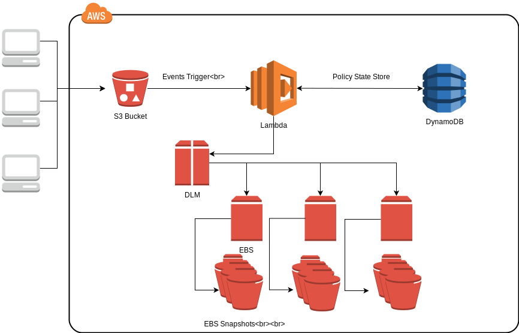

# AWS Data Lifecycle Management Helper
The purpose of adlm-helper is to ease the EBS snapshot policy management of the new AWS feature [Data Lifecyle Management (DLM)](https://aws.amazon.com/about-aws/whats-new/2018/07/introducing-amazon-data-lifecycle-manager-for-ebs-snapshots/) overhead. It allows one to focus managing the policies rather than the execution. 

The policies are to written in the yaml format (so comments are allowed) not the original DLM json format. However the text structure is following the original json. You can easily generate the yaml file if you have already gotten the policies written in json via online tools like [this](https://www.json2yaml.com/).

## Architecture


When user create/update/delete DLM policies to/from the created S3 bucket (`<account-id>-adlm-helper`), the S3 events will trigger the lambda function to create/update/delete the policies to DLM and save the relevant records in DynamoDB. 


## Deployment
The deployment of the package is via AWS [SAM](https://docs.aws.amazon.com/serverlessrepo/latest/devguide/using-aws-sam.html)

### Prerequisite
You must have below tools installed:

1. [AWS Cli](https://docs.aws.amazon.com/cli/latest/userguide/installing.html) (Version must be highter than 1.16.26)
<b>Note:</b> If you want to use a different AWS credential other than the default, you will be either required environment variable`AWS_ACCESS_KEY_ID` and `AWS_SECRET_ACCESS_KEY` or `AWS_PROFILE`.

2. [AWS Sam Cli](https://docs.aws.amazon.com/lambda/latest/dg/sam-cli-requirements.html)

3. Clone this repo

4. Environment variable `S3_BUCKET` points to the bucket your lambda package will be uploaded to

5. Default AWS DLM role created and lambda add to trusted entities
```
# Create the default dlm role. the role name will be similar to arn:aws:iam::123456789012:role/AWSDataLifecycleManagerDefaultRole
$ aws dlm create-default-role

# Add below to existing role trust policy
      {
         "Effect": "Allow",
         "Principal": {
            "Service": "lambda.amazonaws.com"
         },
         "Action": "sts:AssumeRole"
      }
```

### Option 1
This option is for user who has [Go](https://golang.org/doc/install) environment setup and [Dep](https://github.com/golang/dep) installed.

Simply run:

    $ dep ensure
    $ make

### Option 2
This option doesn't require installation like option 1. 

- Step 1: Create a directory `build` if it doesn't exist
- Step 2: Download the `adlmhelper` binary from the [release page](https://github.com/liangrog/adlm-helper/releases) into the `build` folder
- Step 3: Run `make sam`

## Usage

### Policy Example
Please refer to the example in [here](examples/example.yaml).
